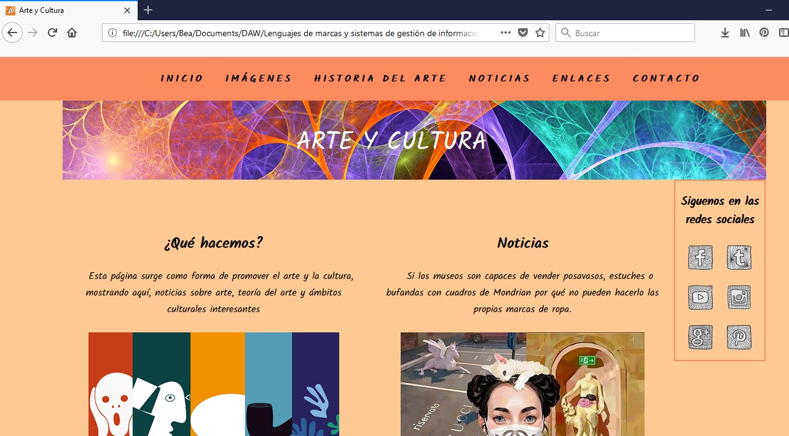
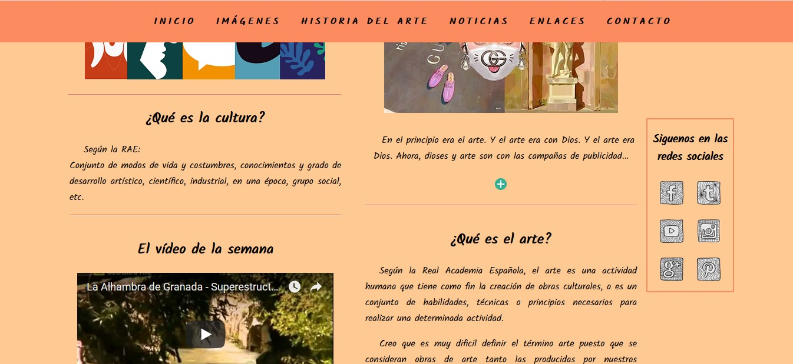
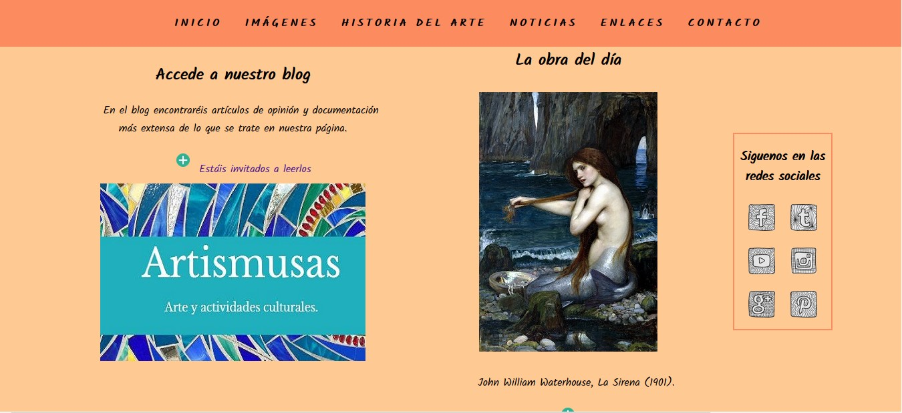
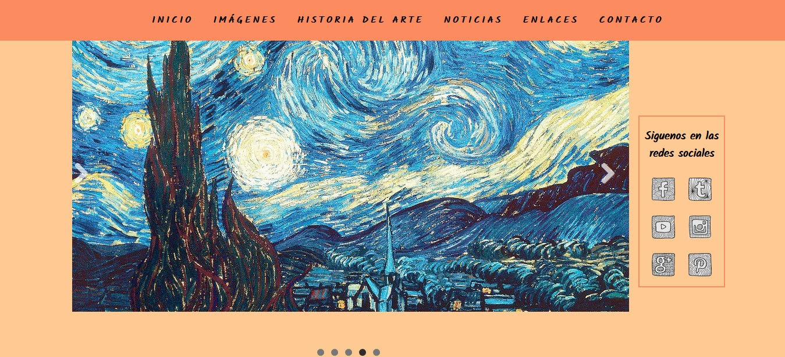
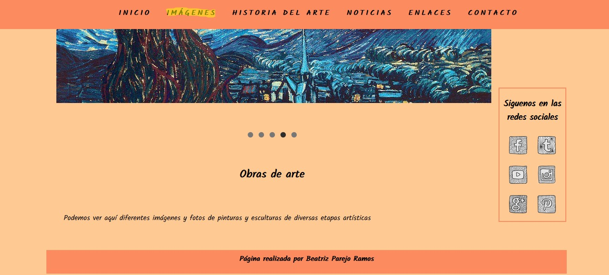
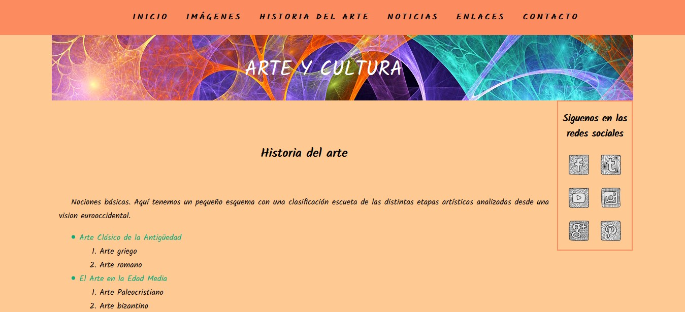

# ejercicios-HTML-CSS
Prácticas con HTML y CSS

**Ejercicios de la asignatura Lenguajes de marcas y sistemas de gestion de información de primero de DAW.**

Aquí subiré distintos ejercicios que vaya realizando a lo largo del curso con lenguajes como HTML5 y CSS.

Dejo aquí un octogato y el enlace &#128515;:

[Esto no es un octogato](https://octodex.github.com/notocat)

## Ejemplo con capturas de la carpeta 9-Página Web

### Inicio

[1]

[2]

[3]

### Imágenes

[4]

[5]

### Historia del arte

[6]
